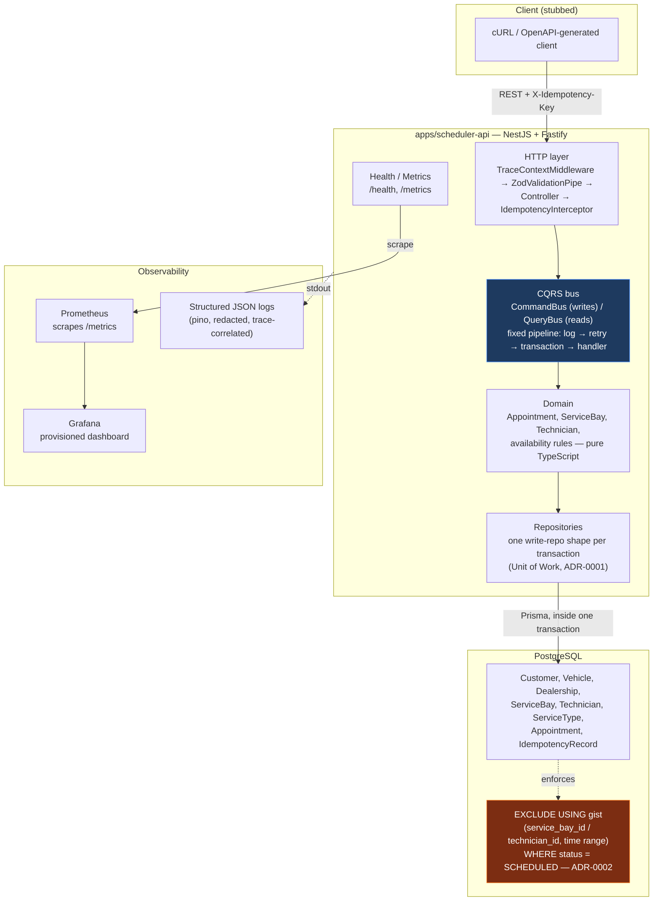

# System Design Document

> This is the "System Design Document" deliverable for this scenario. It
> covers: an architecture diagram, component roles, data flow, chosen technologies with
> justification, the observability strategy, a dedicated GenAI-in-design-phase section, and a
> deferred-scope section explaining what was deliberately left out and why.

## 1. Architecture diagram

## 2. Component roles

| Component | Role |
|---|---|
| **HTTP layer** (`infrastructure/http/`) | Translates HTTP ↔ Command/Query. `TraceContextMiddleware` opens trace correlation; `ZodValidationPipe` validates input per-route; `IdempotencyInterceptor` prevents a double-submit from creating two appointments; `GlobalExceptionFilter` maps every error (validation, domain, unhandled) to one consistent response shape. |
| **CQRS bus** (`packages/shared-kernel/src/cqrs/`) | `CommandBus` runs every write through a fixed pipeline: log → retry (transient DB errors only) → open transaction → handler. `QueryBus` runs reads outside a transaction. Neither the retry nor the transaction boundary is opt-in per command — see ADR-0001. |
| **Domain** (`src/modules/<domain>/domain/`, added as the scheduler domain is implemented) | Pure TypeScript entities and the availability/booking business rules. No framework, no ORM — see `directives/folder_structure_sop.md`, lint-enforced. |
| **Repositories** (`infrastructure/database/prisma/`) | One write-repo shape per service (`SchedulerApiRepos`), constructed fresh per transaction — a repository instance is never usable outside the transaction it was built for (ADR-0001 §2.1). |
| **PostgreSQL** | System of record. Also the idempotency store (`IdempotencyRecord` table) and the enforcement point for the anti-double-booking guarantee (the exclusion constraint, ADR-0002) — the database is not a passive store here, it actively rejects a class of invalid state. |
| **Prometheus + Grafana** | Scrape `/metrics` (default Node.js process metrics + `scheduler_api_db_transient_error_total`), render a dashboard (`docker-init/grafana/provisioning/`). |
| **Structured logs** | JSON to stdout, `pino`. Automatic secret/PII redaction, automatic trace-id correlation — no call site opts in or forgets (`directives/logging_standard.md`). |

## 3. Data flow

### Booking — `POST /appointments`, `BookAppointmentHandler`

1. Client `POST`s a booking request with an `X-Idempotency-Key` header.
2. `TraceContextMiddleware` opens a trace context (reuses an inbound `traceparent` if present).
3. `IdempotencyInterceptor` claims the idempotency key (`INSERT ... response: null` before the
   handler runs) — a retried request with the same key either replays the cached response or gets
   a fast `409` if the first attempt is still in flight, never runs the handler twice.
4. `ZodValidationPipe` validates the request body against `bookAppointmentSchema`.
5. The controller constructs a `BookAppointmentCommand` (no bay/technician id — the server
   selects, ADR-0003 §2.2) and dispatches it via `CommandBus`.
6. `CommandBus` opens a transaction (`PrismaTxRunner`); `BookAppointmentHandler`:
   - resolves the service type and derives `endAt` from `durationMinutes`;
   - rejects outside `BUSINESS_HOURS_*` with `422 APPOINTMENT_OUTSIDE_BUSINESS_HOURS` (ADR-0003 §2.3);
   - reads candidate bays, qualified technicians, and the busy resource set for the window — **all
     three inside this transaction**, never through a query-repo (`directives/cqrs_pattern.md`'s
     transactional-read rule);
   - picks the first free bay and technician deterministically (`selectFirstFree`, ADR-0003 §2.2) —
     no candidate free on either side ⇒ `409 APPOINTMENT_SLOT_CONFLICT` here, **before** any write;
   - constructs the `Appointment` entity and calls `save()` on the write repository.
7. The `INSERT` either succeeds, or the database's exclusion constraint rejects it (`23P01`,
   surfacing through Prisma as `P2039` — verified live, not assumed, see
   `infrastructure/repositories/exclusion-violation.ts`) if a conflicting appointment committed
   between step 6's read and this write — the **only** point where the guarantee is enforced
   unconditionally (ADR-0002 §3). `PrismaAppointmentRepository.save()` translates it into
   `AppointmentSlotConflictError('service_bay_taken_concurrently' | 'technician_taken_concurrently')`.
8. This error carries no `transient: true`, so `CommandBus`'s retry wrapper does **not** retry it
   (ADR-0003 §2.4) — it propagates straight to `GlobalExceptionFilter` as `409`.
9. On success, the transaction commits; `IdempotencyInterceptor` persists the response for future
   replay; `ResponseInterceptor` wraps it in the standard envelope; `HttpLoggingInterceptor` logs
   the outcome; `scheduler_api_booking_attempt_total{outcome}` is incremented either way.

### Availability — `GET /availability`, `CheckAvailabilityHandler`

No transaction, no lock (ADR-0003 §2.6) — reads run through `PrismaBookingQueryRepository` on the
plain client. One query each for the service type, the dealership's bays, its qualified
technicians, and every `SCHEDULED` appointment overlapping the **whole requested day**; every
candidate slot (stepped by `SLOT_GRANULARITY_MINUTES` across `BUSINESS_HOURS_*`) is then evaluated
against that one result set in memory, returning free-bay/technician **counts**, not ids.

### Cancellation — `POST /appointments/:id/cancel`, `CancelAppointmentHandler`

Transactional; looks up the appointment, calls `Appointment.cancel()` (pure domain logic — see
`CancelOutcome`), and only writes on a real `SCHEDULED → CANCELLED` transition. Already-`CANCELLED`
is a no-op `200`; `COMPLETED` is `409 APPOINTMENT_NOT_CANCELLABLE`. The freed window becomes
bookable immediately: ADR-0002's constraints are scoped to `status = 'SCHEDULED'`.

## 4. Technology choices, with justification

| Technology | Why |
|---|---|
| **NestJS + Fastify** | NestJS's DI + module system gives the CQRS wiring and the lint-enforced Hexagonal boundaries a natural home; Fastify over Express for lower overhead and first-class TypeScript-friendly plugin ecosystem (`@fastify/*`). |
| **PostgreSQL + Prisma** | Postgres because the flagship requirement (ADR-0002) needs a real relational database with range-type and exclusion-constraint support — not every database can express this guarantee declaratively. Prisma for type-safe queries and migrations, with the understanding (and one hand-written exception, ADR-0002) that its schema DSL doesn't cover every Postgres feature. |
| **CQRS + Unit-of-Work (`@scheduler/shared-kernel`)** | Ported rather than built from scratch — see §6 below on GenAI's role here. Chosen over a simpler "service layer" pattern because it makes the transaction boundary structural (ADR-0001) instead of a discipline to remember, which matters directly for a domain whose core requirement is a concurrency guarantee. |
| **Zod, per-route, no global pipe** | One validation library, applied explicitly where needed — see `directives/zod_validation.md` for why the global-pipe/DTO-class ergonomics of `nestjs-zod` weren't adopted at this scope. |
| **No Redis** | The idempotency store and the booking guarantee are both Postgres-native (`IdempotencyRecord`, the exclusion constraint). Adding Redis would be infrastructure for a problem Postgres already solves — see `.ai/plans/init-source.plan.md` §8.3. |
| **Prometheus + Grafana, provisioned as code** | Directly requested by the brief ("your strategy for observability"). Provisioning as code (not clicking through a UI) means the dashboard exists on any machine that clones the repo. |
| **No message broker, no second service** | See §5 below — deferred, not omitted. |

## 5. § Deferred scope

Every capability below was considered and deliberately **not built**, with the condition that
would bring it in. This section exists because *"clarity, logic, and foresight"* is explicitly
part of the evaluation — foresight is demonstrated by naming the boundary and its trigger, not by
building unused infrastructure or staying silent about what's missing.

| Capability | What it would do | Trigger | Where the seam is |
|---|---|---|---|
| **Transactional Outbox + message broker** | Reliably notify a customer/dealership when a booking is confirmed/cancelled, decoupled from the request | The first requirement for asynchronous notification work that can't just be a synchronous side effect of the booking request | `directives/resilience_patterns.md` §2; the CQRS command pipeline already has a clean point to append an outbox row in the same transaction |
| **Circuit breaker** | Protect against a slow/failing outbound dependency | The first synchronous call to something this service doesn't own (a DMS integration, a payment gateway) | `packages/shared-kernel`'s `resilience/circuit-breaker.ts` exists in the reference project, framework-free, ready to port back — `directives/resilience_patterns.md` §3.1 |
| **Rate limiting** | Protect against abusive traffic | Public-facing deployment, or evidence of abuse during testing | `directives/resilience_patterns.md` §4 |
| **A second service** | Split out a bounded context with its own release cadence | A genuinely separate bounded context appears (e.g. a standalone notifications service) | The monorepo shape (Turborepo, `apps/*`) already supports adding a workspace without restructuring |
| **RBAC / multi-tenancy** | Restrict who can book/view/cancel; isolate one dealership's data from another's | The assessment doesn't require it; would matter for a real multi-dealership deployment | `directives/multi_tenancy.md` exists in the reference project, not ported — see `.ai/plans/init-source.plan.md` §4 |
| **Kafka-consumer idempotency (natural-key/dedup-constraint patterns)** | Dedup for an eventual message consumer | Arrives together with the message broker above | `directives/idempotency_strategy.md`'s own deferred section |
| **Raw-SQL availability query** (`NOT EXISTS`/`tstzrange &&`, index-supported by the `btree_gist` index ADR-0002 already added) | Replace the current 3-query-plus-in-memory-filter approach in `CheckAvailabilityHandler`/`BookAppointmentHandler` | Hundreds of bays/technicians per dealership, or the availability endpoint appearing in a real latency budget | ADR-0003 §4; the overlap predicate is already written twice (Prisma-native), so the rewrite is mechanical, not a redesign |
| **Per-dealership business hours** (`DealershipOpeningHours` table) | Let each dealership configure its own open/close/timezone instead of one `BUSINESS_HOURS_*` config for all | A second dealership with materially different hours needs to be demoed or sold | ADR-0003 §2.3/§4 — deliberately not built now because it costs a migration next to the hand-written exclusion constraints |
| **Load-balanced resource selection** | Spread bookings across bays/technicians instead of always filling the lowest-ordered one first | `scheduler_api_booking_attempt_total{outcome="*_taken_concurrently"}` rises while other bays sit idle | ADR-0003 §2.2/§5 — deterministic selection was chosen for reproducibility, not because balancing is undesirable |

**Why this list, not a longer one, and not a shorter one**: the reference project (Cortex) this
repo's base was ported from is a 5-service platform with Kafka, Elasticsearch, and a 19-container
compose file — genuinely earned there, by a platform that grew into those problems over time. None
of that infrastructure is earned by a single appointment-booking endpoint on day one. Shipping it
here would read as imitating enterprise architecture rather than understanding when each piece
becomes necessary — the opposite of the foresight this criterion asks for.

## 6. Observability strategy

**Logging**: structured JSON via `pino` (`createLogger`), one root logger per process, every
component injects a child logger — never an ad-hoc `createLogger()` call, never `console.log`
(`directives/logging_standard.md`). Every log line carries an explicit `context` tag
(`packages/shared-kernel/src/logger/log-context.ts`) and, automatically, W3C trace-correlation
fields (`trace_id`/`span_id`) — no call site has to remember either. Secrets and PII are redacted
in-process, before any transport, at any nesting depth.

**Metrics**: Prometheus scrapes `GET /metrics` — Node.js process defaults (CPU, heap, event-loop
lag) via `prom-client`'s `collectDefaultMetrics()`, `scheduler_api_db_transient_error_total` from
the shared-kernel resilience module, and two booking-domain metrics
(`infrastructure/observability/booking.metrics.ts`):

- `scheduler_api_booking_attempt_total{outcome}` — Counter, one increment per booking attempt.
  `outcome="booked"` for a success; `no_free_service_bay`/`no_free_qualified_technician` for the
  application-level check refusing the window; `service_bay_taken_concurrently`/
  `technician_taken_concurrently` for ADR-0002's exclusion constraint catching a race the
  application check missed — a nonzero rate on the last two is the guarantee visibly working, not
  an error budget being spent.
- `scheduler_api_availability_check_duration_seconds` — Histogram, wall-clock time for one
  `GET /availability` computation; its buckets are tuned to make a regression past the in-memory
  approach's sane range visible (ADR-0003 §4's trigger for the raw-SQL rewrite).

A Grafana dashboard (`scheduler-overview.json`, provisioned as code) visualizes service-up, CPU,
heap, event-loop lag, and a booking panel built on the two metrics above.

**Tracing**: W3C `traceparent` propagation across the HTTP boundary (`TraceContextMiddleware` +
the automatic log-field injection above). This is correlation-id tracing, not full distributed
tracing (no span tree, no Jaeger/Tempo backend) — the honest scope is stated explicitly in
`directives/logging_standard.md` rather than implied by the presence of trace IDs in logs.

**Health**: `GET /health` checks the database connection and returns `200`/`503` accordingly —
what a container orchestrator or a load balancer would probe.

## 7. GenAI use in the design phase

See [`docs/12_ai_collaboration.md`](12_ai_collaboration.md) for the full account (Direction,
Context engineering, Guardrails, Verification loop, Where the AI was wrong, What stayed human).
Summary for this document specifically:

The base of this repository (monorepo tooling, CQRS/Unit-of-Work kernel, AI-agent workflow) was
**ported from an existing reference project** with AI assistance, guided by a written init plan
(`.ai/plans/init-source.plan.md`) created *before* any file was copied — the plan named which
files to port as-is, which to strip of business content, which to defer to a later tier, and why,
with every claim about the source project verified against its actual working tree rather than
assumed. During porting, the AI surfaced and fixed several real, verified issues that only
appeared once code actually ran (a Prisma 7 schema syntax change, two missing dependencies that
only worked in the source project by accident of monorepo hoisting, a `fastify` package-version
duplication breaking TypeScript's structural typing) — logged in `.ai/memory/gotchas.jsonl` as
they were found, not reconstructed afterward.

Each subsequent phase followed the same shape — a committed plan with a *References & Compliance*
section, written before its code: [`booking-domain.plan.md`](../.ai/plans/booking-domain.plan.md)
and [`hardening.plan.md`](../.ai/plans/hardening.plan.md). The design-phase output of the second one
is [ADR-0003](adr/0003-availability-and-selection-policy.md), which answered four questions
(availability algorithm, resource-selection policy, source of business hours, retry policy for a
slot conflict) **before** any handler existed — including the one ADR-0002 §6 had explicitly left
open.

The decisions that were **not** delegated:

- **The anti-double-booking mechanism** (ADR-0002). The AI proposed and implemented the exclusion
  constraint; the choice to solve it at the database layer rather than in application code, and the
  requirement that it be verified live against Postgres rather than read as documentation, was
  directed and checked by a human.
- **The selection and retry policy** (ADR-0003) — that the server selects deterministically rather
  than balancing load, that business hours are configuration rather than a table, and that a slot
  conflict is never auto-retried.
- **Running an adversarial audit against finished, green work**, and then deciding which of its
  findings to fix versus document as deliberate assumptions with a trigger.

That audit is the part worth reading closely, because it is the least flattering: the domain phase
passed every gate with 92 tests and three demonstrably working endpoints, and a pass whose explicit
job was to attack it still found three runtime defects — a `500` on a mistyped id, a misleading
`409` for an unknown dealership, and **no clock reference anywhere in the module**, so bookings in
the past were accepted. Green gates prove the code does what its tests say; they do not prove the
tests asked the right questions. Full account: [`12_ai_collaboration.md`](12_ai_collaboration.md) §5.
