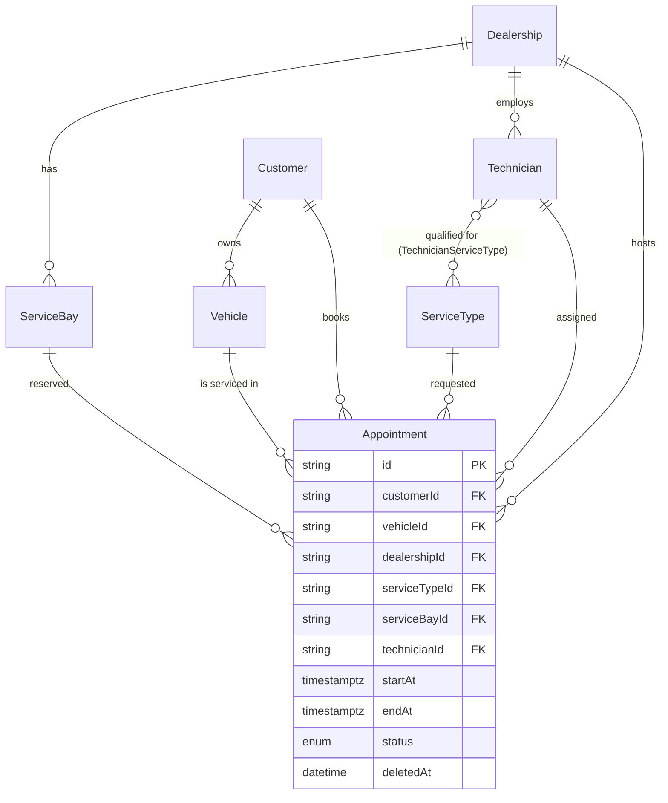

# Database Schema

Source of truth: [`apps/scheduler-api/prisma/schema.prisma`](../apps/scheduler-api/prisma/schema.prisma).
This document explains the shape and the WHY behind the parts that aren't self-evident from the
schema file alone; see `directives/database_standard.md` for the conventions every model follows
(UUID PK, `camelCase`/`@map` snake_case, soft delete via `deletedAt`).

## Entity-relationship overview

## Why a qualification join table, not a skill field

`TechnicianServiceType` (composite PK `[technicianId, serviceTypeId]`) exists because requirement
2 says "a qualified Technician" — qualification is per (technician, service type) pair, not a
single attribute on `Technician`. See `docs/01_business_requirements.md`'s Assumptions table for
the full reasoning; `prisma/seed.ts` deliberately gives its three technicians *different*
qualification sets so the check is demoable, not vacuously true.

## Why `startAt`/`endAt` are `@db.Timestamptz(3)`, not Prisma's default

Prisma's default `DateTime` maps to a naive `timestamp` (no timezone) in Postgres. The
anti-double-booking exclusion constraint (ADR-0002) needs a real `tstzrange`, which requires a
`timestamptz` column — an explicit `@db.Timestamptz(3)` annotation, not the default.

## `IdempotencyRecord` — ported, not new

Shape ported verbatim from Cortex's `core-api` schema (see `.ai/plans/init-source.plan.md` §8.1/§8.3) — the same
model backs `infrastructure/http/idempotency/idempotency.interceptor.ts`. There is no Redis in
this stack; Postgres is the idempotency store.

## The constraint Prisma can't express

Two `EXCLUDE USING gist` constraints on `Appointment` — one on `(service_bay_id, time range)`, one
on `(technician_id, time range)`, both scoped to `status = 'SCHEDULED' AND deleted_at IS NULL` —
are hand-added SQL in the first migration
(`apps/scheduler-api/prisma/migrations/*_init/migration.sql`), not expressible in `schema.prisma`.
**Full reasoning, alternatives considered, and live verification: [ADR-0002](adr/0002-booking-concurrency-control.md).**

⚠️ Any future migration touching `Appointment` must preserve this block by hand — a bare `prisma
migrate dev` regeneration or a `prisma db push` would not know to recreate it. See the migration
file's own comment and `AGENTS.md`'s Hard Rules.

## Soft delete

`Customer`, `Vehicle`, `Dealership`, `ServiceBay`, `Technician`, `ServiceType`, and `Appointment`
all carry `deletedAt`. `PrismaService`'s Prisma Client Extension auto-filters `deletedAt: null` on
reads for exactly these models (`SOFT_DELETE_MODELS` in `prisma.service.ts`) — see
`directives/database_standard.md` for the mechanism and its escape hatch.

Note the distinction from `Appointment.status = CANCELLED`: soft-delete means "this record should
stop existing"; cancellation is a normal business state transition that still needs to be visible
(e.g. for no-show tracking) — the two are independent, not aliases of each other.
