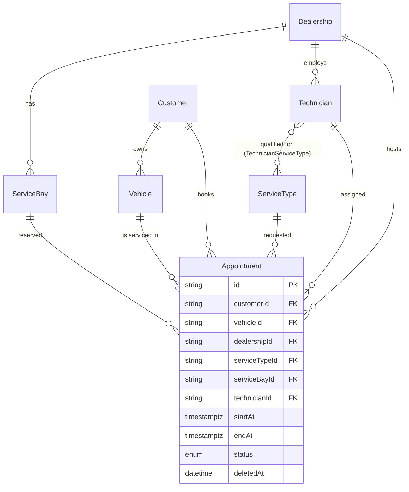

# Database Schema

Source of truth: [`apps/scheduler-api/prisma/schema.prisma`](../apps/scheduler-api/prisma/schema.prisma).
This document explains the shape and the WHY behind the parts that aren't self-evident from the
schema file alone; see `directives/database_standard.md` for the conventions every model follows
(UUID PK, `camelCase`/`@map` snake_case, soft delete via `deletedAt`).

## Entity-relationship overview



## Why a qualification join table, not a skill field

`TechnicianServiceType` (composite PK `[technicianId, serviceTypeId]`) exists because requirement
2 says "a qualified Technician" — qualification is per (technician, service type) pair, not a
single attribute on `Technician`. See `docs/01_business_requirements.md`'s Assumptions table for
the full reasoning; `prisma/seed.ts` deliberately gives its three technicians *different*
qualification sets so the check is demoable, not vacuously true.

## Why `startAt`/`endAt` are `@db.Timestamptz(3)`, not Prisma's default

Prisma's default `DateTime` maps to a naive `timestamp` (no timezone) in Postgres. The
anti-double-booking exclusion constraint (ADR-0002) needs a real `tstzrange`, which requires a
`timestamptz` column — an explicit `@db.Timestamptz(3)` annotation, not the default.

## `IdempotencyRecord` — ported, not new

Shape ported verbatim from Cortex's `core-api` schema (see `.ai/plans/init-source.plan.md` §8.1/§8.3) — the same
model backs `infrastructure/http/idempotency/idempotency.interceptor.ts`. There is no Redis in
this stack; Postgres is the idempotency store.

## The constraint Prisma can't express

Two `EXCLUDE USING gist` constraints on `Appointment` — one on `(service_bay_id, time range)`, one
on `(technician_id, time range)`, both scoped to `status = 'SCHEDULED' AND deleted_at IS NULL` —
are hand-added SQL in the first migration
(`apps/scheduler-api/prisma/migrations/*_init/migration.sql`), not expressible in `schema.prisma`.
**Full reasoning, alternatives considered, and live verification: [ADR-0002](adr/0002-booking-concurrency-control.md).**

⚠️ Any future migration touching `Appointment` must preserve this block by hand — a bare `prisma
migrate dev` regeneration or a `prisma db push` would not know to recreate it. See the migration
file's own comment and `AGENTS.md`'s Hard Rules.

**The application-level check mirrors this constraint's arithmetic exactly, on purpose.**
`PrismaAppointmentRepository.findBusyResourceIds` and `PrismaBookingQueryRepository.findOverlappingAppointments`
both use `startAt < windowEnd AND endAt > windowStart` — the same half-open `[start, end)` overlap
test as `tstzrange(start_at, end_at, '[)') &&`. If the two ever disagreed on a boundary, the API
would either reject bookings the database would accept, or advertise slots the database then
rejects with a `409` the caller didn't expect. See
[ADR-0003](adr/0003-availability-and-selection-policy.md) §2.1 — any change to one predicate must
change the other.

## The other constraint Prisma can't express: `service_types_duration_positive`

```sql
ALTER TABLE "service_types"
  ADD CONSTRAINT "service_types_duration_positive" CHECK ("duration_minutes" > 0);
```

Added in a **separate** migration (`20260810150000_service_type_duration_positive`) that touches only
`service_types` — the `appointments` table and its two exclusion constraints are untouched.

This looks like input validation and is not. `Appointment.endAt` is derived as
`startAt + ServiceType.durationMinutes`, so a duration of `0` yields `endAt == startAt`, and
`tstzrange(x, x, '[)')` is the **empty** range. An empty range overlaps nothing — meaning both
anti-double-booking constraints silently stop applying, and unlimited appointments could be stacked
on the same bay and technician at the same instant. Enforcing it only in the booking handler would
leave the hole open to `prisma/seed.ts`, a data-fix script, or any future write path: the same
reasoning ADR-0002 §3 uses to justify the exclusion constraints themselves.

## The index that keeps `Appointment` reads from scanning every dealership

`@@index([dealershipId, status, startAt])`, added in `20260811095104_appointment_dealership_status_start_index`
— a plain composite btree index, fully expressible in Prisma's DSL, unlike the two constraints
above. `BookAppointmentHandler`'s mid-flight busy-set check and every `GET /availability` call both
filter `Appointment` by exactly this predicate shape (`dealershipId` + `status` + a `startAt`/`endAt`
range); without a leading `dealershipId` index, both did a sequential scan of **every** appointment
in the system, not just the requested dealership's.

Measured, not assumed: seeded 6,000 appointments across 30 dealerships directly in Postgres and ran
the exact predicate both methods use. Before the index: `Seq Scan`, all 6,000 rows read, 114 buffers,
2.2ms. After: `Bitmap Index Scan`, only the target dealership's 200 rows read, 8–9 buffers, 0.24–0.3ms.
The scaling class changes, not just the constant — the old plan is O(appointments across the whole
system), the new one is O(this dealership's appointments), so every dealership added previously made
every *other* dealership's bookings slower too.

Column order: equality predicates first (`dealershipId`, `status`), then the one range predicate
that can use sorted index access (`startAt`). `endAt`'s `>` condition stays a post-index filter —
Postgres can only use one range condition for sorted access per index, and it only has to filter the
already-narrowed per-dealership rows, which is cheap (confirmed in the `EXPLAIN` output above).

## Soft delete

`Customer`, `Vehicle`, `Dealership`, `ServiceBay`, `Technician`, `ServiceType`, and `Appointment`
all carry `deletedAt`. `PrismaService`'s Prisma Client Extension auto-filters `deletedAt: null` on
reads for exactly these models (`SOFT_DELETE_MODELS` in `prisma.service.ts`) — see
`directives/database_standard.md` for the mechanism and its escape hatch.

⚠️ **The extension filters `find*`/`count` only — never `create`.** A nested
`create({ data: { customer: { connect: { id } } } })` therefore resolves happily against a
*soft-deleted* customer, and the appointment is created as if nothing were wrong. This is why
`BookAppointmentHandler` reads each foreign key explicitly before writing rather than relying on the
`connect` to fail: the explicit read goes through the extended client, so a soft-deleted row is a
clean `404` instead of a silent success (and a *missing* row is a `404` instead of an untranslated
Prisma error surfacing as `500`).

Note the distinction from `Appointment.status = CANCELLED`: soft-delete means "this record should
stop existing"; cancellation is a normal business state transition that still needs to be visible
(e.g. for no-show tracking) — the two are independent, not aliases of each other.
